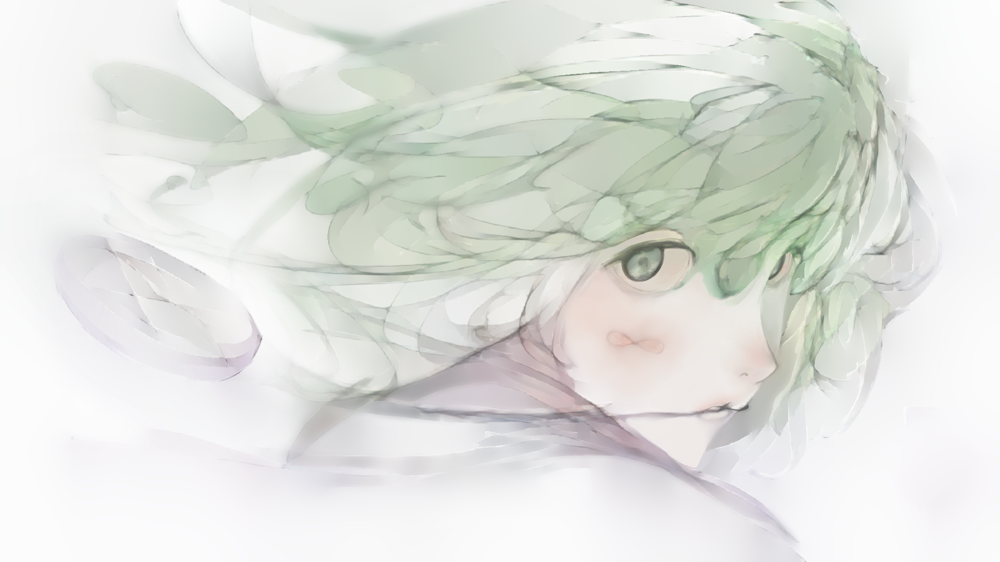
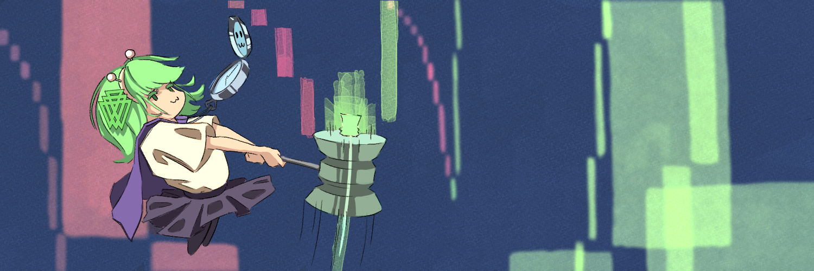
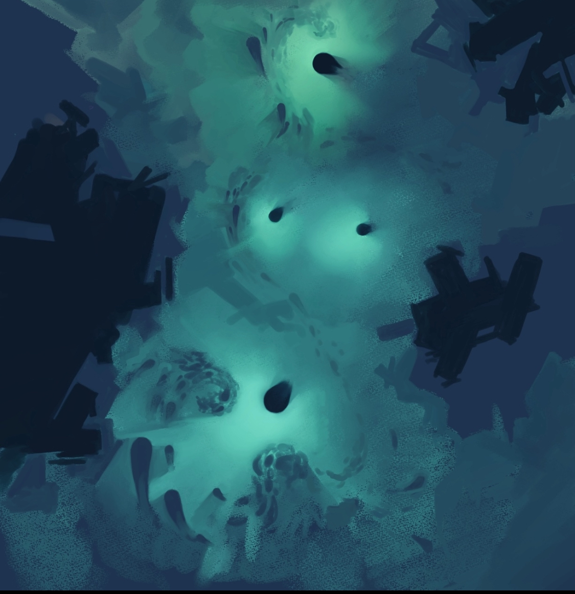

# 2D Art

Some completed stuff. Some commission and school work.

I'm making it a goal to document more of my stuff. I mostly just sketch now due to dropping art as a career option, but I think it would be nice to be able to do some semi-professional stuff on the side some day.

This is the closest thing I've done to professional work. 
A twitter banner for Dave White at Paradigm to commemorate their TWAMM paper.

