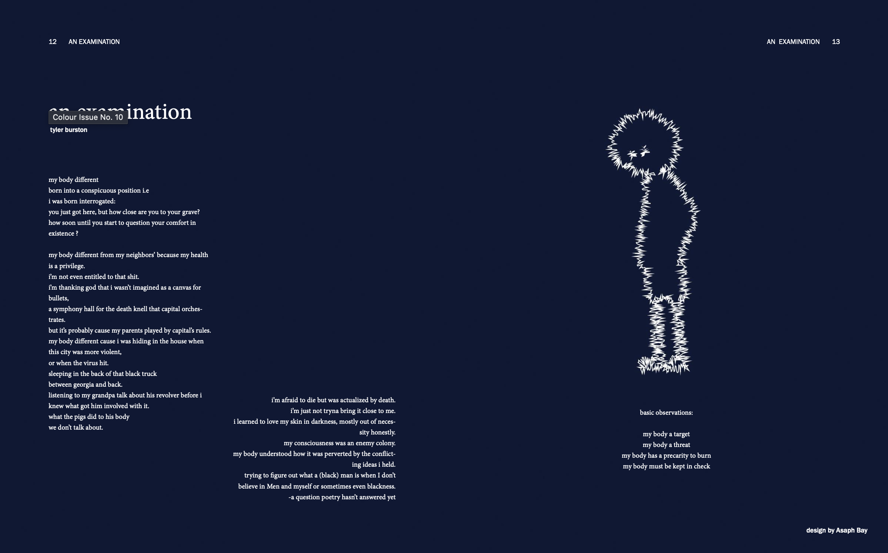
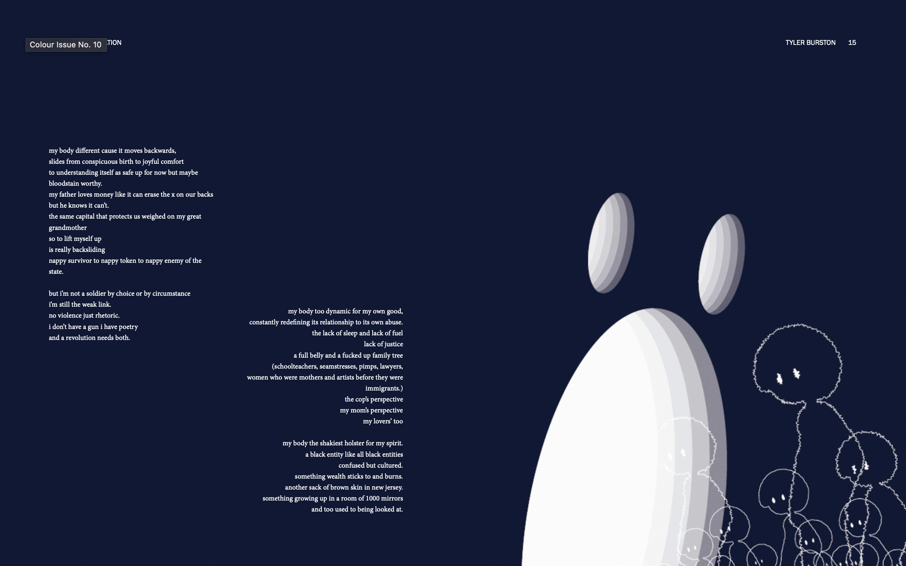
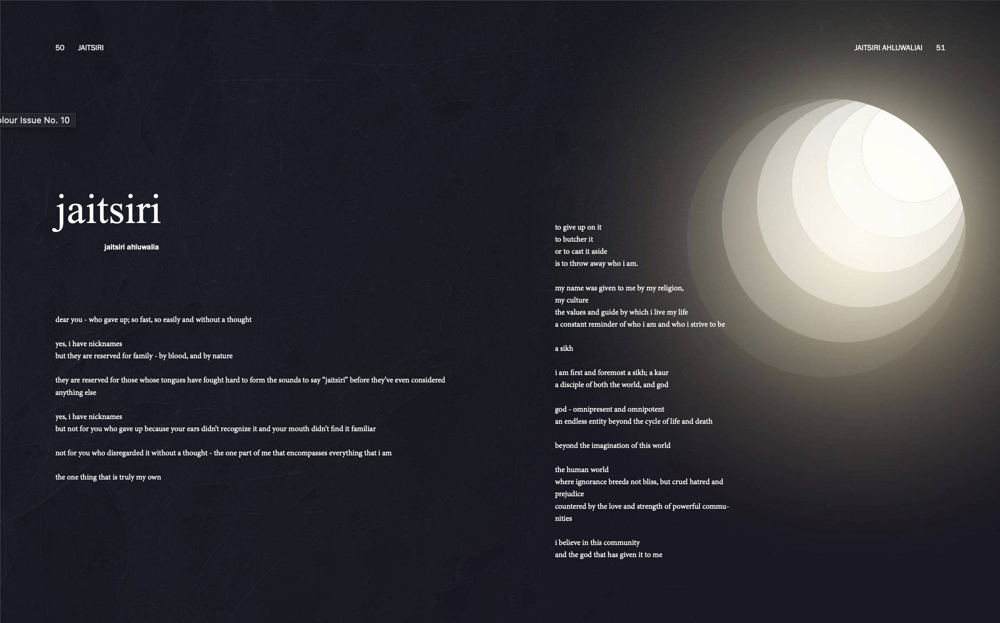
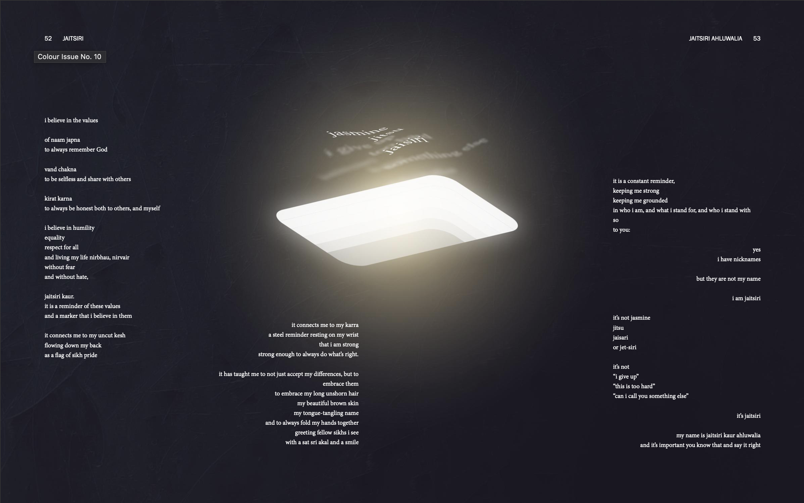
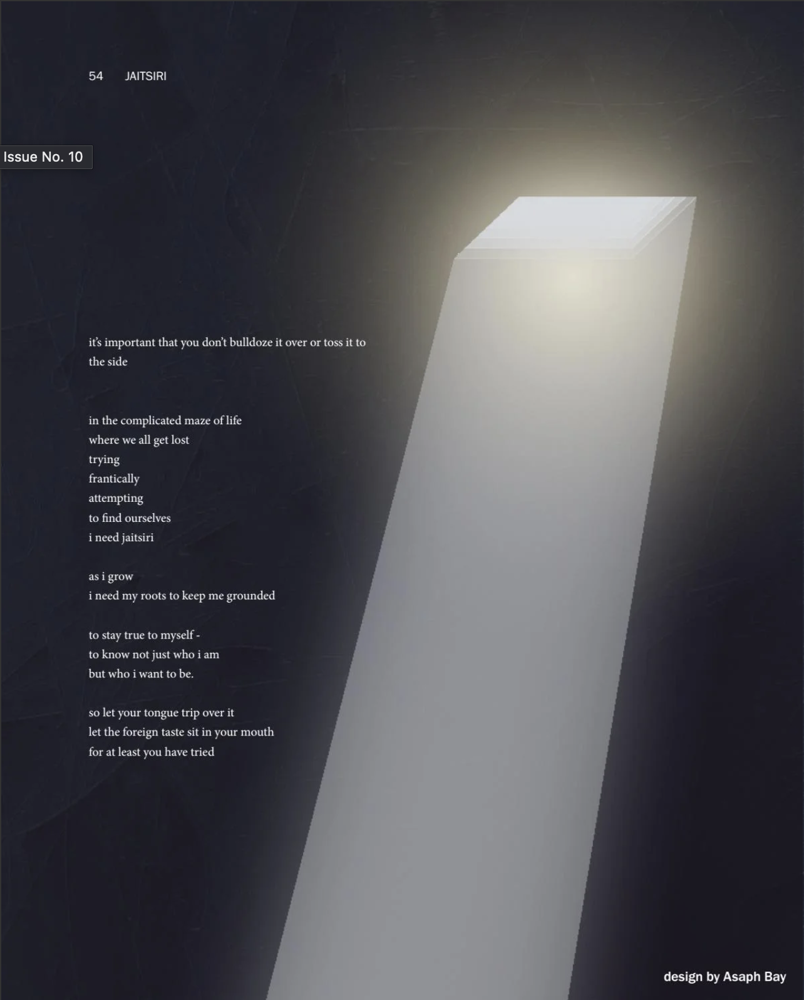
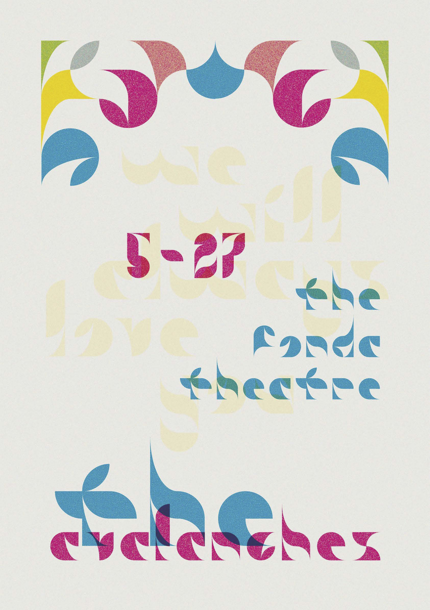
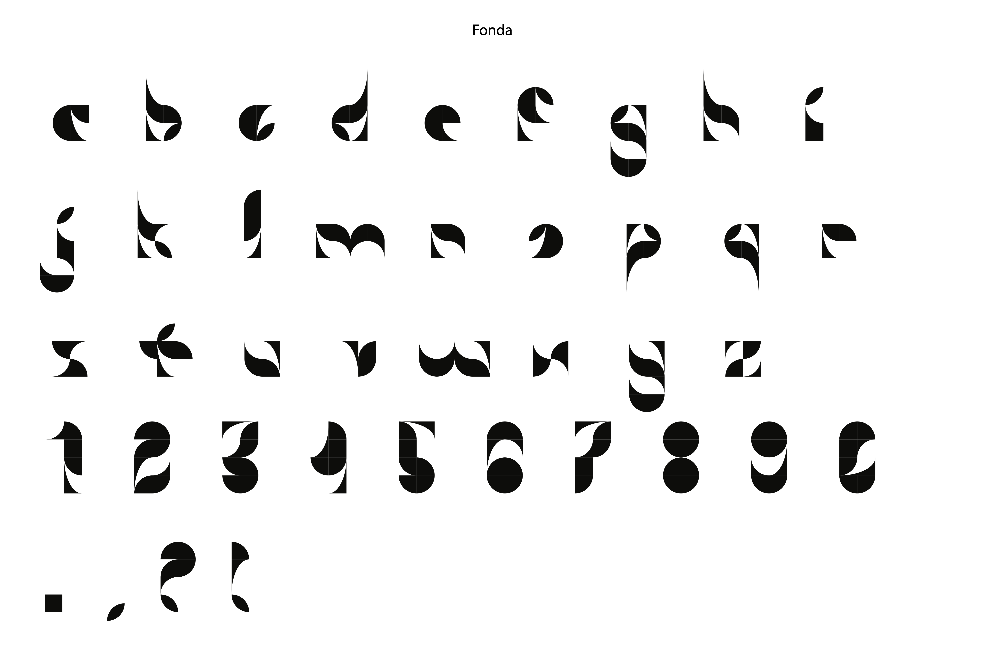

# Design

What I could scrounge.

I did some stuff for a uni magazine, but I don't have any of the files saved. I have screenshots from where they're uploaded! There's a little popup thing that keep getting in the way, though :/. The published versions are on pages 12-17 and 50-54 [here](https://issuu.com/colourmag.wustl/docs/colour_fl20). I think they're kinda nice and clean. These spreads were done in Adobe InDesign.

Also, I thought this typeface project came out pretty nice save for the tiny misalignment!

